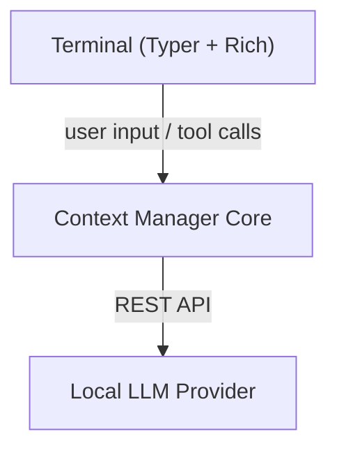

# Torchlight Architecture

Canonical architecture document for Torchlight and the Context Manager CLI.

Related docs:
- [Memory System Deep Dive](memory-system.md)
- [Hardening Checklist](hardening-checklist.md)
- [Excellence Roadmap](excellence-roadmap.md)

## What This Project Is

Torchlight is a terminal-only AI coding agent that wraps a local LLM (LM Studio or Ollama) in an intelligent context management layer. It solves context rot through tiered memory, surgical file reading, and deterministic tool routing.

In practice, the agent:
- keeps the model grounded in the workspace
- prevents context rot
- makes tool execution visible
- helps weaker local models act more like capable coding agents

## What Makes Torchlight Different

The project is not just "chat over an LLM." Its defining ideas are:

- tiered memory instead of a flat transcript
- surgical file reading instead of blindly loading large files
- flashlight retrieval for symbol-aware code context
- deterministic routing for obvious commands
- visible activity and approval flows
- local-first provider support through LM Studio and Ollama-style endpoints

## System Overview

Torchlight is a local-first coding agent stack designed to make small local models behave more like capable software agents through runtime discipline rather than raw model size.

The system has three cooperating layers:

1. Terminal UI
   Typer + Rich chat REPL with live panels, slash commands, and action tracking.
2. Context Manager Core
   Prompts, memory, flashlight retrieval, compression, skills, and tool execution.
3. Local Model Provider
   LM Studio and Ollama-compatible endpoints.

## How To Run

### CLI (primary)

```bash
cd context-manager-cli
./run.sh

# Or after pip install -e .
context chat
context chat --max-tokens 4096
```

## Where A New Contributor Should Start

If you are new to the repo, this is the shortest useful reading order:

1. Read this architecture doc end to end.
2. Skim [README.md](../../README.md) for the fuller repo narrative.
3. Open [cli/main.py](../../context-manager-cli/src/context_manager/cli/main.py) to understand the turn loop and phase detection.
4. Open [memory/manager.py](../../context-manager-cli/src/context_manager/memory/manager.py) to understand context management.
5. Open [tools/core.py](../../context-manager-cli/src/context_manager/tools/core.py) to understand tool execution.

Use this rule of thumb for common changes:

- chat behavior or tool loop: start in `cli/main.py` and `tools/core.py`
- model prompting or context assembly: start in `prompts.py` and `memory/manager.py`
- retrieval or file reading: start in `flashlight/` and `tools/core.py`
- compression or memory: start in `memory/` and `compression/`

## Repository Shape

```text
tourchlight/
├── context-manager-cli/
│   ├── documentation/
│   ├── src/context_manager/
│   │   ├── api/
│   │   ├── cli/
│   │   ├── compression/
│   │   ├── flashlight/
│   │   ├── memory/
│   │   ├── skills/
│   │   ├── tools/
│   │   └── prompts.py
│   └── tests/
├── rlm_optimized/          (experimental)
└── AGENTS.md
```

## Important Directories

- `context-manager-cli/`
  Core reusable intelligence layer and standalone terminal agent.
- `rlm_optimized/`
  Experimental TUI agent with Textual, llama.cpp streaming, and MLX integration.

## Runtime Topology



## End-To-End Turn Flow

This is the most important runtime path in the system:

1. The user sends a message or slash command from the terminal.
2. `_detect_phase()` classifies the turn and loads the appropriate `InferenceParams` preset.
3. `build_messages()` assembles the working context:
   - system prompt
   - flashlight beam (relevant code snippets)
   - recent conversation history
   - state summary (goals, errors, tech stack)
4. The selected local model streams a response.
5. The runtime parses tool calls (`<tool_call>` tags, inline code fences, slash commands).
6. Tool results are bounded and folded back into memory.
7. Compression and state extraction run when thresholds are reached.

The current runtime also adds three important control layers:

- execution-policy routing for obvious requests
- explicit working-set construction before generation
- failure-classified retry and cancel handling

## Prompt Stack

Canonical prompt source:
- [prompts.py](../../context-manager-cli/src/context_manager/prompts.py)

Torchlight uses a layered prompt strategy:

1. `SYSTEM_PROMPT`
   Agent identity, execution rules, small-model discipline.
2. Runtime context
   Flashlight beam, session memory, state summary, and recent turns.

Recent prompt work strengthened agent identity for smaller models by making the prompt more direct, banning common "I can't access your files" collapse patterns, and preferring discover-don't-ask behavior.

This matters because small local models are much more sensitive than large hosted models to:
- prompt dilution
- vague role framing
- oversized working sets
- weak tool-call formatting discipline

## Memory Architecture

Core files:
- [manager.py](../../context-manager-cli/src/context_manager/memory/manager.py)
- [models.py](../../context-manager-cli/src/context_manager/memory/models.py)
- [llm_extractor.py](../../context-manager-cli/src/context_manager/memory/llm_extractor.py)
- [persistence.py](../../context-manager-cli/src/context_manager/memory/persistence.py)

Torchlight uses a four-level memory hierarchy:

1. `L0 Active Prompt`
   Current request, retrieved context, recent tool outputs, and beam hits.
2. `L1 Recent Buffer`
   Most recent messages kept with high fidelity.
3. `L2 Compressed Session Memory`
   Summaries, extracted state, needles, and bounded memory objects.
4. `L3 Project Memory`
   Persistent project-level facts.

Key ideas:
- recent turns stay detailed
- older turns compress aggressively
- exact needles such as file paths, symbols, commands, and errors are preserved
- LLM extraction enriches state when the context budget allows it

For detailed data flow diagrams, token budgets, and compression mechanics, see:
- [Memory System Deep Dive](memory-system.md)

If you are trying to understand why Torchlight exists, memory is the answer. A lot of the product is built around keeping long coding sessions usable even when the active model has a small context window.

## Working-Set Builder

Prompt assembly is now explicit rather than implicit. Before each generation, Torchlight builds a budget-aware working set that tracks:

- included messages
- retrieved memory content
- retrieval token cost
- whether truncation occurred
- high-level counts for files, symbols, and retrieved objects

## Retrieval and File Reading

Core files:
- [beam.py](../../context-manager-cli/src/context_manager/flashlight/beam.py)
- [indexer.py](../../context-manager-cli/src/context_manager/flashlight/indexer.py)
- [core.py](../../context-manager-cli/src/context_manager/tools/core.py)

Torchlight uses two complementary retrieval strategies:

1. Flashlight
   Symbol-aware codebase retrieval that scores files and injects the most relevant snippets.
2. Surgical file reading
   `GREP`, `READ_SYMBOLS`, and `READ_FILE` range-or-symbol reads keep tool output small.

This pairing is what lets 4k-8k local models work from a useful but bounded working set instead of loading whole files into context.

## Tools and Verification

Torchlight supports both execution tools and correctness tools.

Execution-oriented tools include:
- file reads and writes
- shell commands
- workspace inspection
- session and memory operations

Verification-oriented tools include:
- `DOC_SEARCH` for authoritative documentation lookup
- `WEB_VERIFY` for checking API names and snippets against docs

These exist because local models often need runtime help to stay precise.

## Execution Policy

Torchlight now classifies requests before generation when possible.

Examples:
- explicit reads can route directly to `READ_FILE`
- explicit searches can route directly to `GREP`
- explicit commands can route directly to `RUN_COMMAND`
- obvious doc and verify requests can route to verification tools

This reduces wasted reasoning on local models and makes the chosen route visible in activity.

## Execution Feedback Loop

Core files:
- [feedback_loop.py](../../context-manager-cli/src/context_manager/execution/feedback_loop.py)

The execution feedback loop closes the gap between code changes and verification:

```
Code Change → Auto-run Tests → Parse Results → Inject into Context
```

**Key Components:**

1. **WorkingMemory** — Tracks file changes and test results across session
2. **TestRunner** — Auto-detects framework (pytest, npm, cargo) and runs tests
3. **ExecutionFeedbackLoop** — Orchestrates the flow

**Why This Matters:**

Without feedback loops, the model doesn't know if changes broke tests and re-suggests approaches that don't work. With feedback loops, test failures are surfaced immediately and the model learns from runtime feedback.

## Inference and Phase Detection

Core file:
- [lmstudio.py](../../context-manager-cli/src/context_manager/api/lmstudio.py)

Runtime behavior is phase-aware. Different presets are used for code, planning, troubleshooting, and general chat so the model is sampled conservatively when exactness matters and more openly when exploration helps.

## Tooling and Skills

Core files:
- [core.py](../../context-manager-cli/src/context_manager/tools/core.py)
- [base.py](../../context-manager-cli/src/context_manager/skills/base.py)

Design principles:
- safe reads and verification tools are cheap and automatic
- writes and commands require stronger intent or approval
- skills load lazily to avoid startup bloat
- tool output scales to the available context window

## Common Debugging Map

When something is wrong, start here:

- chat or tool loop bugs: `cli/main.py`, `tools/core.py`
- memory pressure or context rot: `memory/manager.py`
- missing code context: `flashlight/beam.py`
- compression issues: `compression/` and `memory/selective_compression.py`
- provider or model issues: `api/lmstudio.py`

## Design Principles

Torchlight's architecture is guided by a few stable rules:

- move as much obvious reasoning as possible into the runtime
- keep the working set inspectable and budget-aware
- preserve exact needles that matter to coding work
- make tool use visible
- degrade gracefully on small local models instead of assuming large-model capacity

## Newcomer Summary

If someone is completely new to Torchlight, the clearest mental model is:

- the terminal is the workspace shell
- `context-manager-cli` is the agent brain
- local model providers are the raw inference engine

Most non-trivial work in this repo is about making that brain use tiny, high-value context slices well enough that a local model can still act like a useful coding agent.

## Current Status

The architecture is already strong enough to support real local-agent workflows. Recent work has already landed deterministic execution routing, explicit working-set construction, provider/model truth, failure-classified retries, and stronger stop/cancel visibility.

The next work is less about major rewrites and more about deeper inspection surfaces, richer retry strategy explanation, and continued polish around long-session trust.
